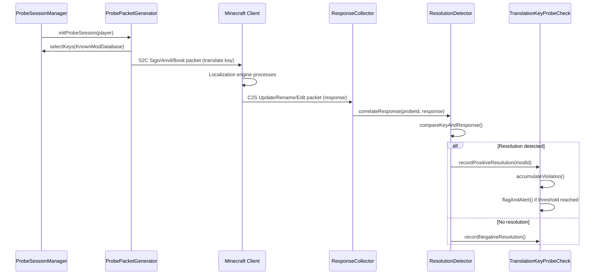

# Design Document: Translation Key Probe

## Overview

The Translation Key Probe check detects hacked Minecraft clients by exploiting their client-side localization mechanism. When a hacked client (Meteor Client, Wurst, Item Scroller, Freecam, etc.) receives a translation key specific to its installed mods, its localization engine automatically resolves the key to human-readable text. Legitimate vanilla clients simply echo back the unresolved key.

The check operates by sending specially crafted GUI packets (signs, anvils, books) containing mod-specific translation keys and monitoring the client's response. When a client echoes back resolved text instead of the original key, it reveals the presence of specific mods.

### Key Exploit Mechanism

1. **Server** sends probe packet containing `{"translate": "key.meteor-client.open-gui"}`
2. **Vanilla client** echoes back `"key.meteor-client.open-gui"` (unchanged)
3. **Hacked client** echoes back `"Open GUI"` (resolved via Meteor Client's lang files)
4. **Detection** occurs when response differs from original key

This approach enables silent, passive detection without requiring server-side resource packs or client modifications.

## Architecture

### Component Hierarchy

```
TranslationKeyProbeCheck (extends Check, implements PacketCheck)
├── KnownModDatabase (translation key registry)
├── ProbeSessionManager (session lifecycle management)
├── ProbePacketGenerator (packet construction)
├── ResponseCollector (client response tracking)
├── ResolutionDetector (key resolution analysis)
└── ClientFingerprintTracker (persistent fingerprint storage)
```

### Data Flow



## Components and Interfaces

### 1. TranslationKeyProbeCheck

**Responsibility**: Main check class integrating all components and managing violation logic.

```java
@CheckData(
    name = "TranslationKeyProbe",
    stableKey = "grimnatorac.exploit.translation_key_probe",
    description = "Detects hacked clients via translation key resolution probing",
    decay = 0,
    setback = Integer.MAX_VALUE,
    experimental = false
)
public class TranslationKeyProbeCheck extends Check implements PacketCheck {
    private final KnownModDatabase modDatabase;
    private final ProbeSessionManager sessionManager;
    private final ResponseCollector responseCollector;
    private final ResolutionDetector resolutionDetector;
    private final ClientFingerprintTracker fingerprintTracker;
    
    // Config fields
    private int silentViolationThreshold;
    private long violationDecayIntervalMs;
    private long probeTimeoutMs;
    private long minProbeIntervalMs;
    
    @Override
    public void onPacketReceive(PacketReceiveEvent event);
    
    @Override
    public void onReload(ConfigManager config);
}
```

### 2. KnownModDatabase

**Responsibility**: Stores and manages translation keys associated with known hacked clients.

```java
public class KnownModDatabase {
    // Map: mod identifier -> Set of translation keys
    private final Map<String, Set<String>> modKeyRegistry;
    
    public Set<String> getKeysForMod(String modId);
    public Optional<String> getModIdForKey(String translationKey);
    public void addModKey(String modId, String translationKey);
    public Set<String> getAllKeys();
    public void loadFromConfig(ConfigManager config);
}
```

**Initial database entries**:
- `meteor-client` → `["key.meteor-client.open-gui", "meteor.modules.gui"]`
- `item-scroller` → `["itemscroller.gui.button.config_gui.generic"]`
- `freecam` → `["key.freecam.toggle", "freecam.config.title"]`
- `accurate-block-placement` → `["text.autoconfig.accurateblockplacement.title"]`

### 3. ProbeSessionManager

**Responsibility**: Manages probe session lifecycle, scheduling, and rate limiting.

```java
public class ProbeSessionManager {
    // Map: player UUID -> active ProbeSession
    private final Map<UUID, ProbeSession> activeSessions;
    
    // Rate limiting
    private final Map<UUID, Long> lastProbeTime;
    private final Queue<UUID> probePriorityQueue;
    
    public void scheduleInitialProbe(GrimPlayer player, long delayMs);
    public Optional<ProbeSession> startProbeSession(GrimPlayer player);
    public void abortSession(UUID playerUuid);
    public void cleanupExpiredSessions();
    public boolean canProbe(GrimPlayer player);
}
```

**ProbeSession** inner class:
```java
public static class ProbeSession {
    private final UUID sessionId;
    private final UUID playerUuid;
    private final long startTimeMs;
    private final Map<String, String> keyToModId; // probe keys sent
    private final ProbeDeliveryMechanism mechanism;
    private final Set<String> receivedResponses;
    
    public boolean isExpired(long timeoutMs);
    public void recordResponse(String response);
}
```

### 4. ProbePacketGenerator

**Responsibility**: Constructs server-to-client GUI packets containing translation keys.

```java
public class ProbePacketGenerator {
    private final Random random = new Random();
    
    public enum ProbeDeliveryMechanism {
        SIGN_EDIT,      // Open sign editor with translation key
        ANVIL_RENAME,   // Open anvil with translation key in rename field
        BOOK_EDIT       // Open book with translation key in pages
    }
    
    public void sendProbe(
        GrimPlayer player,
        ProbeSession session,
        Set<String> translationKeys
    );
    
    private ProbeDeliveryMechanism selectRandomMechanism();
    private Object constructSignPacket(String translationKey);
    private Object constructAnvilPacket(String translationKey);
    private Object constructBookPacket(Set<String> translationKeys);
}
```

**JSON text format**: All probe packets use Minecraft's JSON text component format:
```json
{"translate": "key.meteor-client.open-gui"}
```

### 5. ResponseCollector

**Responsibility**: Monitors client-to-server packets for responses to probe sessions.

```java
public class ResponseCollector {
    // Map: session ID -> ProbeSession
    private final Map<UUID, ProbeSession> pendingSessions;
    
    public void registerPendingSession(ProbeSession session);
    public void handleSignUpdate(UUID playerUuid, WrapperPlayClientUpdateSign packet);
    public void handleItemRename(UUID playerUuid, WrapperPlayClientRenameItem packet);
    public void handleBookEdit(UUID playerUuid, WrapperPlayClientEditBook packet);
    
    private Optional<ProbeSession> getSessionForPlayer(UUID playerUuid);
}
```

### 6. ResolutionDetector

**Responsibility**: Analyzes client responses to determine if translation keys were resolved.

```java
public class ResolutionDetector {
    private final KnownModDatabase modDatabase;
    
    public enum ResolutionResult {
        POSITIVE_RESOLUTION,  // Key was resolved (mod present)
        NEGATIVE_RESOLUTION,  // Key unchanged (no mod)
        INCONCLUSIVE          // Cannot determine (network issues, etc.)
    }
    
    public ResolutionResult detectResolution(
        String originalKey,
        String clientResponse,
        int playerPing
    );
    
    public Optional<String> identifyMod(String resolvedKey);
    
    private String normalizeText(String text);
}
```

**Normalization rules**:
- Convert to lowercase
- Trim leading/trailing whitespace
- Collapse multiple spaces to single space
- Remove color codes and formatting

### 7. ClientFingerprintTracker

**Responsibility**: Generates and persists unique fingerprints for detected mod configurations.

```java
public class ClientFingerprintTracker {
    // Map: player UUID -> ClientFingerprint
    private final Map<UUID, ClientFingerprint> fingerprints;
    
    public static class ClientFingerprint {
        private final String hash;
        private final Set<String> resolvedModIds;
        private final long firstDetectionMs;
        private final long lastDetectionMs;
        
        public static ClientFingerprint compute(Set<String> modIds);
    }
    
    public void recordFingerprint(UUID playerUuid, Set<String> detectedMods);
    public Optional<ClientFingerprint> getFingerprint(UUID playerUuid);
    public boolean hasFingerprintChanged(UUID playerUuid, Set<String> newMods);
    public void loadFromPersistence();
    public void saveToPersistence();
}
```

**Fingerprint computation**:
```
hash = SHA256(sorted_mod_ids.join(","))
```

## Data Models

### KnownModDatabase Storage

**In-memory structure**:
```java
Map<String, Set<String>> modKeyRegistry = {
    "meteor-client": ["key.meteor-client.open-gui", "meteor.modules.gui"],
    "item-scroller": ["itemscroller.gui.button.config_gui.generic"],
    "freecam": ["key.freecam.toggle", "freecam.config.title"],
    "accurate-block-placement": ["text.autoconfig.accurateblockplacement.title"]
}
```

**Configuration file format** (`config.yml`):
```yaml
TranslationKeyProbe:
  known-mods:
    meteor-client:
      - "key.meteor-client.open-gui"
      - "meteor.modules.gui"
    item-scroller:
      - "itemscroller.gui.button.config_gui.generic"
    freecam:
      - "key.freecam.toggle"
      - "freecam.config.title"
    accurate-block-placement:
      - "text.autoconfig.accurateblockplacement.title"
```

### ProbeSession State

```java
class ProbeSession {
    UUID sessionId;              // Random UUID for correlation
    UUID playerUuid;             // Target player
    long startTimeMs;            // Session start timestamp
    ProbeDeliveryMechanism mechanism; // SIGN_EDIT | ANVIL_RENAME | BOOK_EDIT
    
    // Mapping of sent keys to expected mod IDs
    Map<String, String> keyToModId = {
        "key.meteor-client.open-gui": "meteor-client",
        "key.freecam.toggle": "freecam"
    };
    
    // Responses received from client
    Set<String> receivedResponses;
}
```

### ClientFingerprint Persistence

**Storage format** (JSON file `fingerprints.json`):
```json
{
  "550e8400-e29b-41d4-a716-446655440000": {
    "hash": "a3f8b9c2...",
    "resolvedModIds": ["meteor-client", "freecam"],
    "firstDetectionMs": 1704067200000,
    "lastDetectionMs": 1704153600000
  }
}
```

### Violation State

```java
class ViolationState {
    int silentViolationCount = 0;
    long lastFlagMs = 0L;
    long lastCleanMs = 0L;
    Set<String> detectedMods = new HashSet<>();
}
```


## Correctness Properties

*A property is a characteristic or behavior that should hold true across all valid executions of a system—essentially, a formal statement about what the system should do. Properties serve as the bridge between human-readable specifications and machine-verifiable correctness guarantees.*

### Property Reflection

After analyzing all acceptance criteria, several properties were identified as redundant or overlapping:

- **Database key presence tests** (Requirements 1.2-1.5): These test specific data initialization and are better validated through integration tests rather than universal properties. They are specific examples, not general properties.
  
- **Mechanism-specific tests** (Requirements 2.3-2.5): Testing that each delivery mechanism exists is example-based, not property-based.

- **Packet capture tests** (Requirements 3.2-3.4): Testing specific packet type handling is example-based.

- **Config tests** (Requirement 9.1-9.7): Configuration loading is example-based testing.

- **Framework integration** (Requirement 10.1-10.7): These are structural smoke tests.

The following properties represent unique, universal validation:

### Property 1: Database Key Addition Round-Trip

*For any* valid mod identifier and translation key, when added to the Known_Mod_Database, retrieving keys for that mod identifier SHALL return a set containing that translation key.

**Validates: Requirements 1.6**

### Property 2: Probe Key Selection Validity

*For any* Known_Mod_Database state and probe session initiation, all translation keys selected by the Probe_Manager SHALL exist in the database's key registry.

**Validates: Requirements 2.1**

### Property 3: JSON Probe Packet Format

*For any* translation key, the probe packet generated by ProbePacketGenerator SHALL contain JSON text in the format `{"translate": "<key>"}` where `<key>` is the original translation key.

**Validates: Requirements 2.2**

### Property 4: Delivery Mechanism Randomization

*For any* sequence of N probe packet generations where N ≥ 100, the distribution of delivery mechanisms (SIGN_EDIT, ANVIL_RENAME, BOOK_EDIT) SHALL be approximately uniform (chi-squared test, p > 0.05).

**Validates: Requirements 2.6**

### Property 5: Probe Rate Limiting

*For any* sequence of probe session attempts for the same player, the time interval between consecutive successful probes SHALL be greater than or equal to the configured minimum interval minus ping compensation.

**Validates: Requirements 2.7, 8.2**

### Property 6: Positive Resolution Detection

*For any* probe key K and client response R where normalize(K) ≠ normalize(R), the ResolutionDetector SHALL record a positive resolution.

**Validates: Requirements 3.5, 4.1, 4.5**

### Property 7: Response Timeout Window

*For any* probe session with timeout T, responses arriving at time > (session_start + T) SHALL NOT be associated with that session.

**Validates: Requirements 3.6**

### Property 8: Session Response Correlation

*For any* active probe sessions S1 and S2 with distinct session IDs, a response correlated with S1 SHALL NOT be correlated with S2.

**Validates: Requirements 3.7**

### Property 9: Case-Insensitive Comparison

*For any* probe key K and client response R where R differs from K only in letter casing, the ResolutionDetector SHALL record a negative resolution.

**Validates: Requirements 4.2**

### Property 10: Whitespace-Insensitive Comparison

*For any* probe key K and client response R where R differs from K only in whitespace (leading, trailing, or internal spacing), the ResolutionDetector SHALL record a negative resolution.

**Validates: Requirements 4.3**

### Property 11: Negative Resolution Detection

*For any* probe key K and client response R where normalize(K) = normalize(R), the ResolutionDetector SHALL record a negative resolution.

**Validates: Requirements 4.4**

### Property 12: Partial Resolution Detection

*For any* probe session containing keys {K1, K2, K3, ...}, if the client resolves subset S ⊂ {K1, K2, K3, ...}, the ResolutionDetector SHALL detect exactly |S| positive resolutions with no false positives.

**Validates: Requirements 4.6**

### Property 13: Ping-Compensated Correlation

*For any* player with ping P, responses arriving within (session_start + timeout + P) SHALL be eligible for correlation with that session.

**Validates: Requirements 4.7, 5.7**

### Property 14: Two-Key Flagging Threshold

*For any* detection cycle where exactly N unique mod-specific keys are resolved, the check SHALL flag the player if and only if N ≥ 2.

**Validates: Requirements 5.1**

### Property 15: Silent Violation Accumulation

*For any* sequence of positive resolutions {R1, R2, R3, ...}, staff alerts SHALL fire only when the cumulative count reaches the configured threshold T, not before.

**Validates: Requirements 5.2**

### Property 16: Alert Content Completeness

*For any* staff alert triggered by detection, the alert message SHALL contain all detected mod identifiers from the current detection cycle.

**Validates: Requirements 5.4**

### Property 17: Violation Decay Over Time

*For any* violation state with count V > 0, after a clean gameplay period of duration D ≥ decay_interval, the violation count SHALL decrease by at least 1.

**Validates: Requirements 5.5**

### Property 18: Gamemode Exemption

*For any* player in CREATIVE or SPECTATOR game mode, no probe sessions SHALL be initiated and no violations SHALL be recorded.

**Validates: Requirements 5.6**

### Property 19: Fingerprint Determinism

*For any* two sets of mod identifiers S1 and S2 where S1 = S2 (ignoring order), the computed Client_Fingerprint hashes SHALL be equal.

**Validates: Requirements 6.1, 6.2**

### Property 20: Fingerprint UUID Association

*For any* player UUID U and fingerprint F, storing the association (U, F) and subsequently querying for U SHALL return F.

**Validates: Requirements 6.4**

### Property 21: Fingerprint Change Detection

*For any* player UUID with existing fingerprint F1, when a new fingerprint F2 is computed where F1 ≠ F2, an alert SHALL be generated indicating configuration change.

**Validates: Requirements 6.5**

### Property 22: Blacklist Immediate Detection

*For any* fingerprint in the blacklist registry, when a player's computed fingerprint matches a blacklisted entry, immediate detection SHALL trigger regardless of other thresholds.

**Validates: Requirements 6.7**

### Property 23: Vanilla Control Probe Inclusion

*For any* probe session initiated, at least one vanilla Minecraft translation key SHALL be included in the probe key set.

**Validates: Requirements 7.1**

### Property 24: Vanilla Key Anomaly Detection

*For any* probe session where vanilla translation keys are not resolved correctly (response differs from expected vanilla text), the bypass suspicion flag SHALL be set.

**Validates: Requirements 7.2**

### Property 25: Selective Resolution Bypass Detection

*For any* probe session where all vanilla keys resolve correctly and no mod keys resolve, the potential bypass flag SHALL be set.

**Validates: Requirements 7.4**

### Property 26: Bypass Confidence Scoring

*For any* set of bypass indicators {I1, I2, I3, ...}, the computed confidence score SHALL be monotonically increasing with respect to the number of indicators.

**Validates: Requirements 7.6**

### Property 27: Confidence Threshold Alerting

*For any* bypass confidence score C and configured threshold T, a staff alert SHALL fire if and only if C ≥ T.

**Validates: Requirements 7.7**

### Property 28: Single Concurrent Session Per Player

*For any* player with an active probe session, attempting to start a second probe session SHALL fail until the first session completes or times out.

**Validates: Requirements 8.1**

### Property 29: New Player Prioritization

*For any* probe queue containing both new players (first join) and returning players, new players SHALL be dequeued before returning players with equal or later join times.

**Validates: Requirements 8.4**

### Property 30: Disconnect Session Abortion

*For any* active probe session, when the associated player disconnects, the session SHALL transition to aborted state within one server tick.

**Validates: Requirements 8.5**

### Property 31: Expired Session Cleanup

*For any* probe session in expired state, invoking cleanup SHALL remove the session from active memory structures.

**Validates: Requirements 8.6**

### Property 32: Global Rate Limit Enforcement

*For any* time window of duration W, the total number of probe packets sent across all players SHALL NOT exceed the configured global rate limit for that window.

**Validates: Requirements 8.7**

## Error Handling

### Packet Processing Errors

**Network deserialization failures**: When a client response packet cannot be deserialized (corrupted data, protocol mismatch), log the error and mark the response as INCONCLUSIVE. Do not penalize the player or increment violations.

**Missing session correlation**: When a response packet arrives but no active session exists for that player, silently discard the response. This can occur due to session timeout or player disconnection race conditions.

**Invalid JSON in probe packets**: During probe packet generation, if JSON serialization fails, log the error, abort the probe session, and reschedule the probe after the minimum interval. This prevents sending malformed packets.

### Resource Management Errors

**Database load failure**: If the Known_Mod_Database cannot load from configuration on startup or reload:
1. Log error with configuration file path and exception details
2. Fall back to hardcoded default mod keys (Meteor, Freecam, Item Scroller)
3. Continue check operation with reduced detection capability
4. Do NOT crash or disable the check

**Persistence write failure**: If Client_Fingerprint persistence write fails (disk full, permissions):
1. Log error but continue in-memory operation
2. Retry persistence write on next successful detection
3. Maintain in-memory cache until successful write

**Memory pressure**: If expired session cleanup detects excessive memory usage (> 100 MB for probe sessions):
1. Force-expire all sessions older than 50% of timeout window
2. Log warning about potential session leak
3. Reduce probe scheduling rate by 50% for next 5 minutes

### Detection Edge Cases

**Ambiguous resolutions**: When a client response partially matches the probe key (e.g., key contains the response as substring):
- If response is ≥ 50% different in length, treat as positive resolution
- If response is < 50% different, treat as INCONCLUSIVE
- Log ambiguous cases for manual review

**High-latency connections**: For players with ping > 500ms:
- Double the response timeout window
- Reduce silent violation threshold by 1 (minimum 2)
- Add "[HIGH-PING]" tag to alerts

**Resource pack interference**: When vanilla key resolution fails:
- Do NOT immediately flag as bypass
- Increment bypass suspicion counter
- Require 3 consecutive failed vanilla resolutions before bypass alert
- Log resource pack hash if available

### Configuration Errors

**Invalid threshold values**: If configured thresholds are invalid (negative, zero, non-numeric):
- Log error with parameter name and invalid value
- Use hardcoded defaults:
  - `silent-violation-threshold`: 3
  - `min-probe-interval-ms`: 300000 (5 minutes)
  - `probe-timeout-ms`: 10000 (10 seconds)
  - `decay-interval-ms`: 300000 (5 minutes)

**Hot-reload failures**: If configuration hot-reload encounters errors:
- Retain previous valid configuration
- Log error without disrupting active sessions
- Do NOT abort in-progress probe sessions

## Testing Strategy

### Dual Testing Approach

This feature requires both **unit tests** for discrete logic and **property-based tests** for universal correctness guarantees.

**Unit tests** will focus on:
- Specific examples of mod key initialization (Meteor, Freecam, etc.)
- Packet type handling for sign/anvil/book delivery mechanisms
- Configuration loading and hot-reload behavior
- Framework integration (Check base class, PacketCheck interface)
- Edge cases: empty responses, malformed JSON, null handling

**Property-based tests** will focus on:
- Universal properties defined in Correctness Properties section (Properties 1-32)
- Randomized inputs for keys, responses, timing, player states
- Invariant verification across many iterations (minimum 100 per property)

### Property-Based Testing Configuration

**Testing framework**: [fast-check](https://github.com/dubzzz/fast-check) (JavaScript/TypeScript) or [jqwik](https://jqwik.net/) (Java, preferred for this project)

**Configuration per property test**:
- Minimum iterations: 100 (due to randomization)
- Seed: randomized (for reproducibility, log seed on failure)
- Shrinking: enabled (to find minimal failing examples)

**Property test tagging**: Each property test MUST include a comment referencing its design property:
```java
@Property
// Feature: translation-key-probe, Property 6: Positive Resolution Detection
void testPositiveResolutionDetection(@ForAll String probeKey, @ForAll String clientResponse) {
    // test implementation
}
```

### Test Coverage Targets

- **Unit test coverage**: ≥ 80% line coverage
- **Property test coverage**: All 32 properties must have corresponding tests
- **Integration test coverage**: End-to-end scenarios for each delivery mechanism
- **Performance test**: Probe generation must sustain ≥ 100 probes/second under load

### Mocking Strategy

**External dependencies to mock**:
- `PacketReceiveEvent`: Mock to simulate client packets
- `GrimPlayer`: Mock player state (ping, game mode, position)
- `ConfigManager`: Mock configuration loading
- File I/O for fingerprint persistence

**Real implementations to use** (no mocks):
- `KnownModDatabase`: Test with real in-memory database
- `ResolutionDetector`: Test with real normalization logic
- `ClientFingerprintTracker`: Test with real hash computation

### Integration Testing

**Full workflow tests**:
1. **Sign Delivery E2E**: Generate probe → send sign packet → simulate sign update → verify detection
2. **Anvil Delivery E2E**: Generate probe → send anvil packet → simulate rename → verify detection
3. **Book Delivery E2E**: Generate probe → send book packet → simulate edit → verify detection
4. **Multi-Session**: Start probes for 10 concurrent players → verify sessions isolated
5. **Bypass Detection E2E**: Send vanilla + mod keys → resolve only vanilla → verify bypass alert

**Performance tests**:
- **Probe throughput**: Sustain 100 probes/sec for 60 seconds
- **Memory stability**: Run 1000 sessions → verify no memory leaks (< 1% growth)
- **Cleanup efficiency**: Expire 1000 sessions → measure cleanup time (< 100ms)

